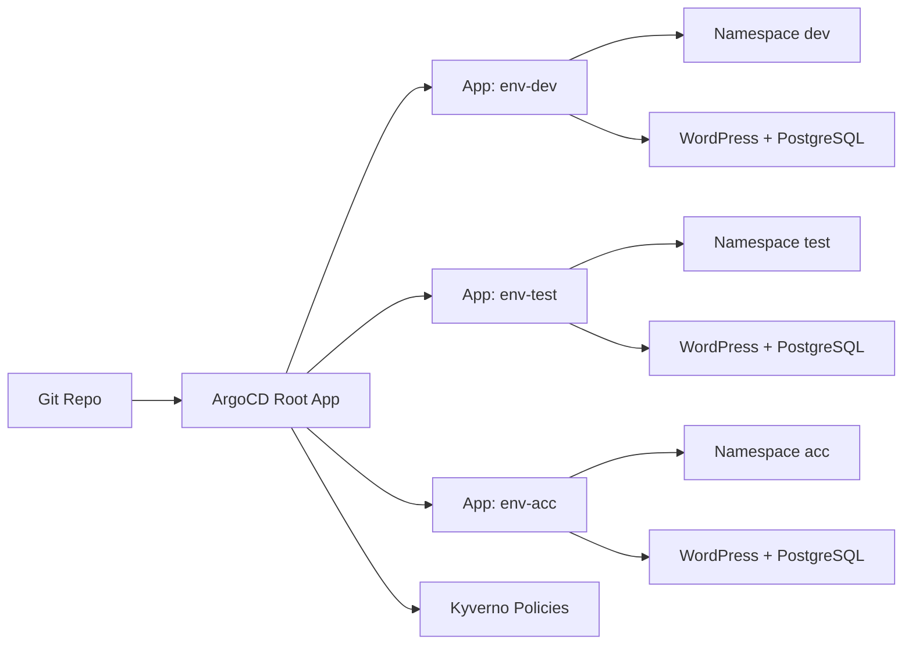

Enterprise Architecture (OpenStack + Kubernetes + GitOps + Agentic AI)
Date: 2026-02-20

Enterprise-grade Architecture: OpenStack + Kubernetes + GitOps + Agentic AI
**Date:** 2026-02-20

1) Target outcomes
- Provision a small Kubernetes cluster on OpenStack using Terraform
- Deploy **three isolated environments** (`dev`, `test`, `acc`)
- Each env runs:
  - `wordpress` (Deployment)
  - `pg-db` (StatefulSet)
- Operate with **GitOps** (Argo CD) + policy guardrails (Kyverno)
- Prepare for **Phase 2** agentic operations (self-healing, auto-remediation)

---

2) Reference architecture

2.1 Logical view (Mermaid)
```mermaid
flowchart TB
  subgraph Public[Internet]
    U[Users]
  end

  subgraph OpenStack[OpenStack on SSDNodes VPS]
    FIP[Floating IP / Single Public IP]
    R[Neutron Router]
    NET[Private Subnet]
    SG[Security Groups]
    VM1[K8s Control Plane VM]
    VM2[K8s Worker VM]
    VM3[K8s Worker VM]
    Cinder[(Cinder Volumes)]
  end

  subgraph K8s[Kubernetes Cluster]
    Ingress[Ingress Controller]
    Argo[Argo CD (GitOps)]
    subgraph Namespaces
      DEV[dev]
      TST[test]
      ACC[acc]
    end
    subgraph AppsDev[dev apps]
      WPD[WordPress]
      PGD[(PostgreSQL)]
    end
    subgraph AppsTst[test apps]
      WPT[WordPress]
      PGT[(PostgreSQL)]
    end
    subgraph AppsAcc[acc apps]
      WPA[WordPress]
      PGA[(PostgreSQL)]
    end
  end

  subgraph Git[Git Repository]
    G1[Terraform]
    G2[K8s Manifests]
    G3[Policies]
  end

  U --> FIP --> Ingress
  R --- NET
  SG --- VM1
  SG --- VM2
  SG --- VM3
  NET --- VM1
  NET --- VM2
  NET --- VM3
  Cinder --- K8s
  Ingress --> DEV
  Ingress --> TST
  Ingress --> ACC
  Argo <-->|sync| Git
  K8s --> WPD --> PGD
  K8s --> WPT --> PGT
  K8s --> WPA --> PGA
```

2.2 GitOps “App-of-Apps” pattern


---

3) Deployment plan (enterprise approach)

Phase A — Baseline platform
1. **OpenStack readiness**
   - One external network with the single public IP as Floating IP pool
   - One private tenant network/subnet
   - Router between private subnet ↔ external network
   - Security groups: SSH + kube API (restricted) + node-to-node + ingress ports
2. **Terraform OpenStack** provisions:
   - Network/subnet/router
   - 3 VMs (1 control plane + 2 workers) with cloud-init
   - Volumes (optional) for persistent storage
3. **Bootstrap Kubernetes**
   - kubeadm or RKE2
   - CNI: Calico
   - Storage: Cinder CSI (preferred) or local-path (fallback)
4. **Install GitOps**
   - Argo CD
   - Ingress controller (NGINX or Traefik)

Phase B — App environments
5. Namespaces: `dev`, `test`, `acc`
6. Per namespace:
   - PostgreSQL StatefulSet + PVC + Service
   - WordPress Deployment + Service
   - Ingress + TLS (Let’s Encrypt via cert-manager optional)
   - NetworkPolicy + Resource limits + Probes

Phase C — Security hardening
7. RBAC least privilege, Pod Security Admission baseline/restricted
8. Network segmentation (default deny + allow rules)
9. Secrets handling (K8s Secrets + sealed-secrets/Vault later)
10. Supply chain: image pinning + SBOM + scanning (Phase 2)

---

4) Security hardening checklist

Kubernetes
- Enable RBAC, disable anonymous auth
- Restrict API server exposure (SG only from admin IP)
- Use PodSecurity (`baseline` or `restricted`)
- NetworkPolicies (deny-all per namespace + allow only necessary)
- Set CPU/memory requests/limits
- Liveness/readiness probes
- Non-root containers where possible

OpenStack
- Tight security groups (22 only from admin IP)
- Separate tenant network
- Consider security group rules for node-to-node traffic only on required ports

GitOps
- Argo CD RBAC + SSO (OIDC)
- Signed commits / protected branches
- Policy checks in CI (kubeconform, kubelinter, trivy)

---

5) ISO 27001 & DORA mapping (platform-focused)

ISO/IEC 27001:2022 Annex A (selected)
- **5.23 Cloud services security** → OpenStack tenant isolation, SG, IaC controls citeturn0search24
- **8.9 Configuration management** → Terraform + GitOps as controlled configuration citeturn0search0
- **8.16 Monitoring activities** → audit logs, metrics, alerting citeturn0search0
- **5.30 ICT readiness for business continuity** → backup/restore, DR patterns citeturn0search24

DORA (platform interpretation)
- DORA sets requirements for ICT risk management, incident reporting, testing, and third-party risk. citeturn1search7
- Incident reporting is further specified via implementing/delegated acts. citeturn1search2turn1search1

> Mapping is implemented through: IaC controls, logging, incident response runbooks, and resilience testing.

---

6) Runbooks
See `docs/runbooks/` (add in your org):
- Cluster bootstrap
- Day-2 ops
- Backup/restore
- Incident response

---
