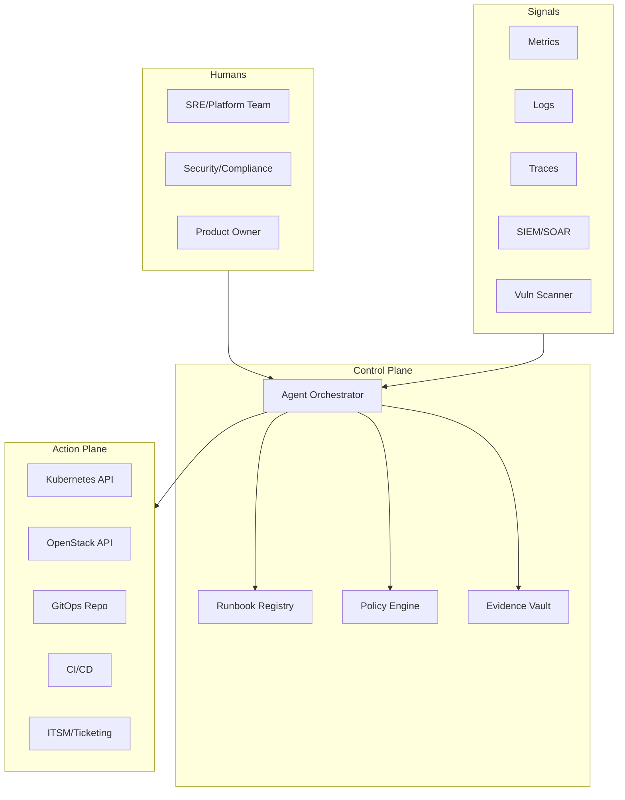

Phase 2 Self-Healing Platform Blueprint
Date: 2026-02-20

Phase 2: Fully Autonomous Self‑Healing Platform Blueprint (Agentic AI)
**Date:** 2026-02-20

Objective
Move from “automated deployments” to **autonomous operations**:
- Detect incidents early
- Auto-remediate common failures
- Enforce security/compliance policies continuously
- Produce audit evidence automatically

---

Reference architecture (Agentic Ops)

---

Agent roles
1. **Infra Agent (OpenStack/Terraform)**
   - Plans & applies Terraform changes
   - Auto-rollbacks on drift or failure
2. **Kubernetes Agent**
   - Diagnoses pod/node issues
   - Executes safe runbooks (restart, reschedule, scale, cordon/drain)
3. **Security Agent**
   - Enforces policies (Kyverno/Gatekeeper)
   - Reviews image provenance (SBOM, signatures)
   - Generates compliance evidence
4. **Release Agent**
   - Opens PRs for config changes
   - Uses canary/blue-green via Argo Rollouts
5. **Observability Agent**
   - Tunes alerts to reduce noise
   - Correlates events across layers

---

Self-healing patterns (examples)
- CrashLoopBackOff → roll back last deployment + open PR with fix suggestion
- Node pressure → drain node, reschedule pods, add worker VM via Terraform
- Database PVC full → alert + expand volume (where supported) + vacuum/analyze runbook
- Ingress 5xx spike → scale WordPress pods + rate-limit + WAF rule suggestion

---

Guardrails (non-negotiables)
- Agents act only via **approved runbooks**
- Changes go through GitOps PRs for “destructive” actions
- Separation of duties (security approvals)
- Full audit log of decisions/actions

---

Compliance evidence automation
Produce artifacts continuously:
- Change logs (commit → deployment)
- Vulnerability scan reports
- Policy violations and remediation proof
- Backup/restore test evidence
- Incident timelines (MTTD/MTTR)

DORA emphasizes operational resilience requirements and incident reporting obligations. citeturn1search7turn1search2

---
